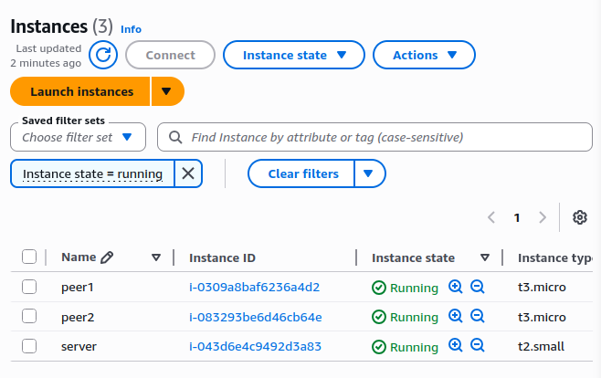
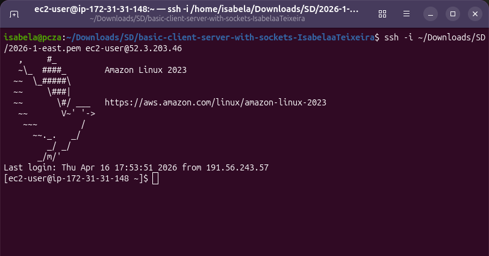
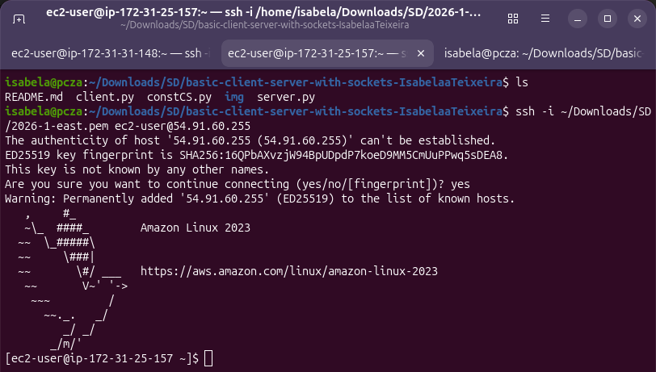
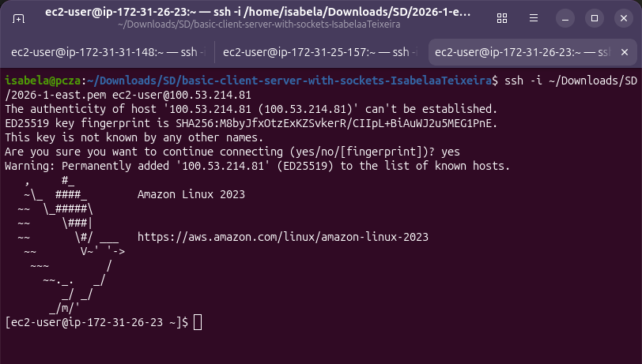
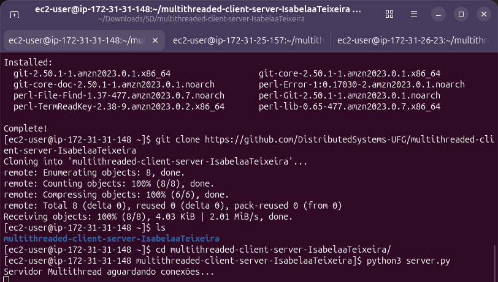
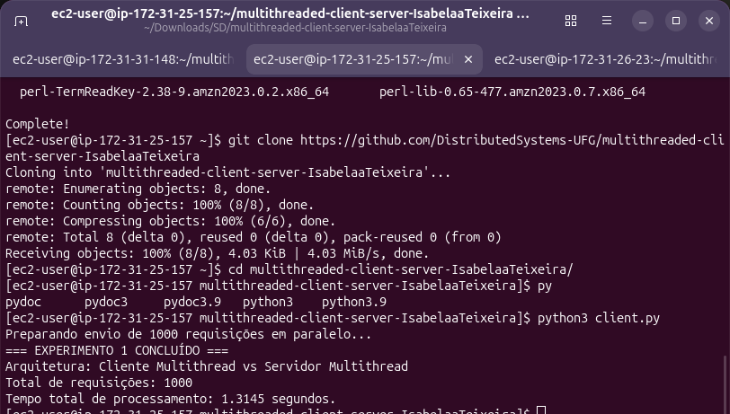
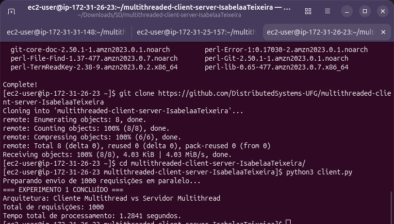
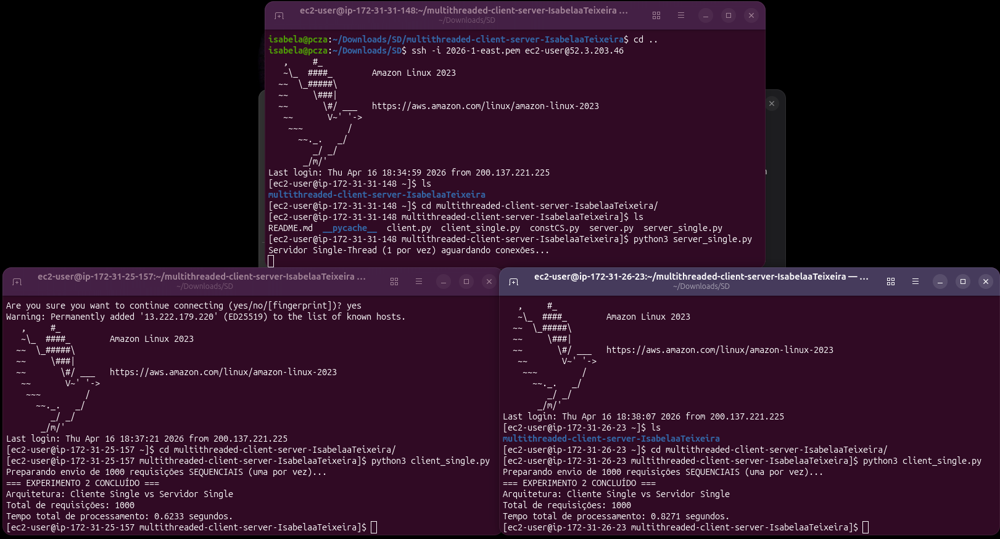
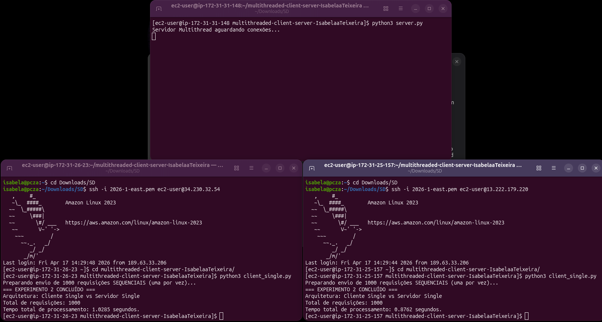

# Tarefa ASR 05 - Cliente e Servidor Multithread com Avaliação de Desempenho

Este repositório contém a evolução da arquitetura Cliente-Servidor desenvolvida na tarefa ASR 04. Implementamos **Multithreading** e **Automação de Requisições**, realizando um estudo prático de desempenho na AWS.

## 1. Configuração da Infraestrutura (AWS Academy)

Configuramos 3 instâncias no AWS Academy (N. Virginia): 2 instâncias `peer` (clientes) e 1 instância `server` com Elastic IP fixo.

### Acessando as instâncias via SSH
Acessamos as máquinas via terminal utilizando o usuário `ec2-user`:

- **Terminal 1 (Server):** `ssh -i 2026-1-east.pem ec2-user@52.3.203.46`

- **Terminal 2 (Client 1):** `ssh -i 2026-1-east.pem ec2-user@34.230.32.54`

- **Terminal 3 (Client 2):** `ssh -i 2026-1-east.pem ec2-user@13.222.179.220`

### Configuração de Rede
O IP Privado do servidor foi configurado no arquivo `constCS.py` em todas as máquinas para permitir a comunicação interna:
`HOST = '172.31.31.148'`

---

## 2. Lógica de Processamento (Kit de Forense Digital)

O servidor foi programado para executar três funções complexas:
1. **`analise_entropia`**: Cálculo de entropia de Shannon (detecção de dados criptografados).
2. **`extrair_ips`**: Extração de padrões IPv4 em logs usando Regex.
3. **`cifra_xor`**: Ofuscação de strings via operação bit a bit.

---

## 3. Experimentos de Desempenho (1.000 Requisições)

Realizamos a coleta de dados em três cenários distintos para avaliar o impacto do paralelismo:

### Teste 1: Tudo Multithread (Paralelo)
- **Servidor:** Cria uma thread por conexão.
- **Cliente:** Dispara 1.000 requisições simultâneas em threads.
- **Tempo médio:** ~1.31 segundos.

### Teste 2: Tudo Single-Thread (Sequencial)
- **Servidor:** Atende um por vez.
- **Cliente:** Envia 1.000 requisições em um laço `for` simples.
- **Tempo médio:** ~0.62 segundos.

### Teste 3: Híbrido (Cliente Single vs Servidor MT)
- **Servidor:** Multithread.
- **Cliente:** Sequencial.
- **Tempo médio:** ~1.02 segundos.

| Cenário de Teste | Arquitetura do Cliente | Arquitetura do Servidor | Tempo Total |
| :--- | :--- | :--- | :--- |
| **Teste 1** | Multithread (Paralelo) | Multithread (Paralelo) | **1.3145 segundos** |
| **Teste 2** | Single-thread (Sequencial) | Single-thread (Sequencial) | **0.6233 segundos** |
| **Teste 3** | Single-thread (Sequencial) | Multithread (Paralelo) | **1.0285 segundos** |

---

## 4. Análise dos Resultados

Observamos que a versão **Single-Thread foi mais rápida** neste experimento. Isso ocorre devido a dois fatores técnicos:
1. **Overhead de Criação:** Criar 1.000 threads simultâneas gera um custo de processamento (alocação de memória e troca de contexto) que supera o tempo das contas matemáticas simples que o servidor executa.
2. **Python GIL:** O *Global Interpreter Lock* do Python limita o paralelismo real em tarefas que dependem exclusivamente de CPU (CPU-bound), como os nossos cálculos de entropia.

**Conclusão:** O Multithreading seria superior em tarefas de I/O (como banco de dados ou rede lenta), mas para processamento rápido de CPU, o modelo sequencial evitou o engarrafamento de threads.